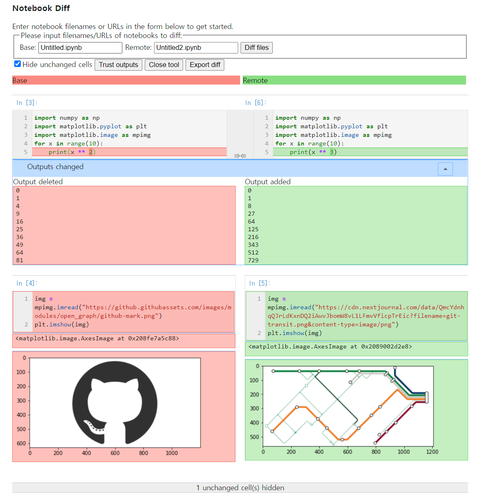

How should you handle version control and diffs for Jupyter notebooks?

When you write code in Jupyter, version control with git is not always easy. Change a single simple figure and you get a diff as hard to read as the one below.

```diff

@@ -27,27 +27,27 @@
     "import matplotlib.pyplot as plt\n",
     "import matplotlib.image as mpimg\n",
     "for x in range(10):\n",
-    "    print(x ** 2)"
+    "    print(x ** 3)"
    ]
   },
   {
    "cell_type": "code",
-   "execution_count": 4,
+   "execution_count": 5,
    "metadata": {},
    "outputs": [
     {
      "data": {
       "text/plain": [
-       "<matplotlib.image.AxesImage at 0x208fe7a5c88>"
+       "<matplotlib.image.AxesImage at 0x2089002d2e8>"
       ]
      },
-     "execution_count": 4,
+     "execution_count": 5,
      "metadata": {},
      "output_type": "execute_result"
     },
     {
      "data": {
-      "image/png": "iVBORw0KGgoAAAANSUhEUgAAAXcAAADTCAYAAAB6OlOyAAAAOXRFWHRTb2Z0d2FyZQBNYXRwbG90bGliIHZlcnNpb24zLjMuMywgaHR0cHM6Ly9tYXRwbG90bGliLm9yZy/Il7ecAAAACXBIWXMAAAsTAAALEwEAmpwYAAA0oklEQVR4nO3deXxU1fn48c8zyUz2FQIEEtYgiwIKERFBUQSsSwUVvrYW+boU/blhrVZQq3VrcStqXSq4gS1W/YqIiiggrQuILLIjEFlMwhJCFgJZJ/P8/sidNCBLtpk7mTnv1yuvzF1yzzlzM889c+6554iqYhiGYQQXh90ZMAzDMJqfCe6GYRhByAR3wzCMIGSCu2EYRhAywd0wDCMImeBuGIYRhHwS3EXkIhHZIiJZIjLZF2kYhmEYxyfN3c9dRMKArcAIIAdYAfxKVTc1a0KGYRjGcfmi5j4QyFLV7apaCfwLuNwH6RiGYRjH4Yvg3gHIrrOcY60zDMMw/CTcroRFZCIwESAmJmZAz5497cqKYRhGi7Rq1ap8VU051jZfBPdcIL3Ocpq17giqOh2YDpCZmakrV670QVYMwzCCl4jsOt42XzTLrAC6i0gXEXEBVwPzfJCOYRiGcRzNXnNXVbeI3AZ8BoQBr6vqxuZOxzAMwzg+n7S5q
.....
```
Here are a few ways around the difficulty of reading Jupyter notebook diffs.

## 1. Clear all notebook outputs before committing

If you strip the outputs and then commit, you get a relatively clean diff. For example, when a graph figure or image output changes, the binary change shows up as-is in the .ipynb diff; clearing the outputs before committing spares you the long binary diff. The downside is that the results are not saved.

## 2. Convert the .ipynb file to Python code and save that

You can convert .ipynb to .py. As with method 1, the downside is that the results are not saved.

```bash
jupyter nbconvert something.ipynb --to="python"
```

## 3. Use nbdime

nbdime: Jupyter Notebook Diff and Merge tool. [https://github.com/jupyter/nbdime](https://github.com/jupyter/nbdime)

Think of it as a modified form of git diff. With nbdime you can read the diffs of Jupyter files intuitively.

* Check the diff on the command line

```bash
nbdiff commit1 commit2 filepath
```
Output:
```diff
## inserted before /cells/1:
+  code cell:
+    execution_count: 5
+    source:
+      img = mpimg.imread("https://cdn.nextjournal.com/data/QmcYdnhqQJrLdKxnDQ2iAwvJbomW8vL1LFmvVficpTrEic?filename=git-transit.png&content-type=image/png")
+      plt.imshow(img)
+    outputs:
+      output 0:
+        output_type: execute_result
+        execution_count: 5
+        data:
+          text/plain: <matplotlib.image.AxesImage at 0x2089002d2e8>
+      output 1:
+        output_type: display_data
+        data:
+          image/png: iVBORw0K...<snip base64, md5=aaad22f9e6b12552...>
+          text/plain: <Figure size 432x288 with 1 Axes>
+        metadata (unknown keys):
+          needs_background: light

## deleted /cells/1:
-  code cell:
-    execution_count: 4
-    source:
-      img = mpimg.imread("https://github.githubassets.com/images/modules/open_graph/github-mark.png")
-      plt.imshow(img)
-    outputs:
-      output 0:
-        output_type: execute_result
-        execution_count: 4
-        data:
-          text/plain: <matplotlib.image.AxesImage at 0x208fe7a5c88>
-      output 1:
-        output_type: display_data
-        data:
-          image/png: iVBORw0K...<snip base64, md5=2cbb1d38259c0c72...>
-          text/plain: <Figure size 432x288 with 1 Axes>
-        metadata (unknown keys):
-          needs_background: light
```

* Check the diff in a web view

```bash
nbdiff-web commit1 commit2 filepath
```
Output:



* Use nbdime by default in git

After running the command below, `git diff` shows .ipynb files, and only those, through nbdiff.

```
nbdime config-git --enable --global
```

## Reference
[https://nextjournal.com/schmudde/how-to-version-control-jupyter](https://nextjournal.com/schmudde/how-to-version-control-jupyter)
