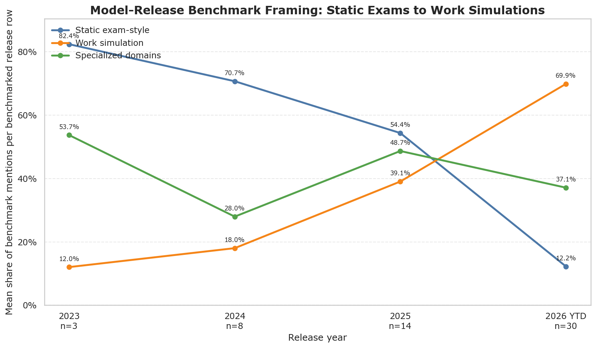
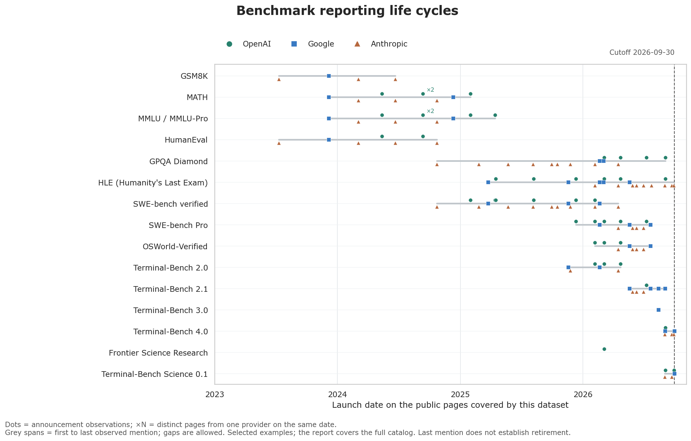
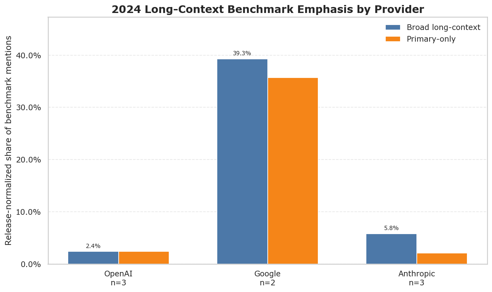
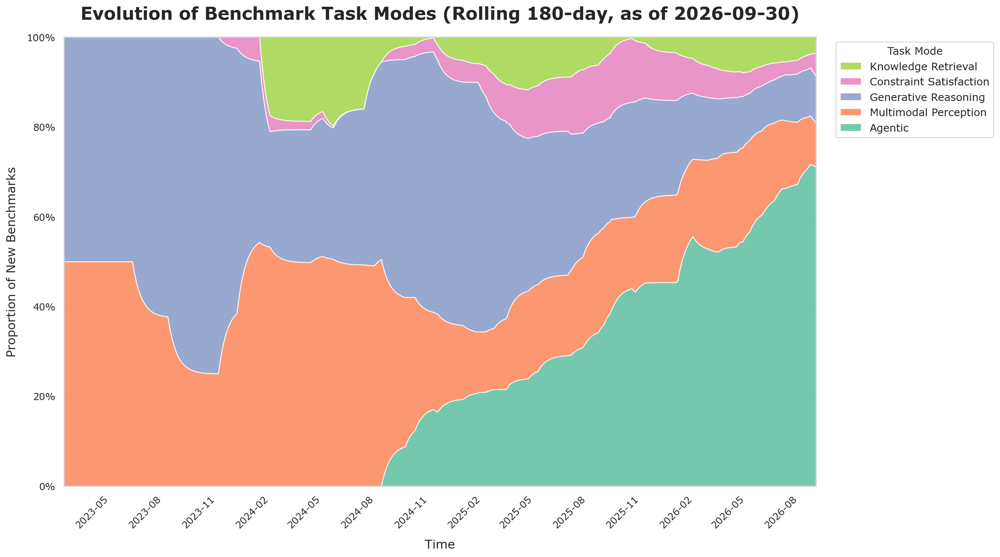
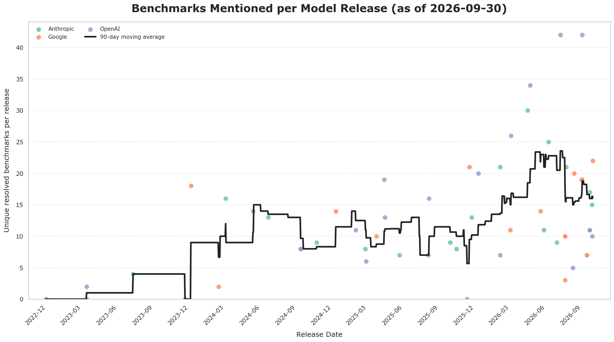

This project tracks benchmark and evaluation names published on the launch pages for frontier models from OpenAI, Google, and Anthropic. It follows how those benchmark portfolios have changed over time: from academic tests and static question sets toward coding environments, tool use, computer interaction, and other work-like tasks.

## The dataset

The unit of evidence is a benchmark mention on a public model-release page. A benchmark is associated with a model when it appears on that page. Technical reports, system cards, and benchmark papers are used to verify catalog metadata such as authorship, aliases, and task design.

| Provider | Releases | First release | Latest release |
| --- | ---: | --- | --- |
| OpenAI | 21 | 2022-11-30 | GPT-6.1 Sol (2026-09-29) |
| Google | 17 | 2023-12-06 | Gemini 4 Argon (2026-09-30) |
| Anthropic | 21 | 2023-03-14 | Claude 5.5 Sonnet (2026-09-28) |

The current snapshot covers releases through September 30, 2026. Release discovery and source checks were refreshed through October 4, 2026, and the results are in the [source and identity audit](https://github.com/isingmodel/evolution_of_benchmarks_in_frontier_models/blob/main/docs/data_refresh_2026_10_04.md).

Every release that lists benchmarks carries the same total weight; 55 of the 59 tracked releases do. If a launch page lists ten resolved benchmarks, each receives one tenth of that release's weight. This keeps releases with long benchmark tables from dominating the time series.

The main files are:

| File | Contents |
| --- | --- |
| [models.csv](https://github.com/isingmodel/evolution_of_benchmarks_in_frontier_models/blob/main/data/models.csv) | Model releases, dates, source URLs, and raw benchmark mentions |
| [benchmarks.csv](https://github.com/isingmodel/evolution_of_benchmarks_in_frontier_models/blob/main/data/benchmarks.csv) | Canonical benchmark catalog and provenance |
| [benchmark_aliases.csv](https://github.com/isingmodel/evolution_of_benchmarks_in_frontier_models/blob/main/data/benchmark_aliases.csv) | Exact alias-to-benchmark mappings |
| [benchmark_facets.csv](https://github.com/isingmodel/evolution_of_benchmarks_in_frontier_models/blob/main/data/benchmark_facets.csv) | Multi-label taxonomy assignments and review status |
| [benchmark_distinctness.csv](https://github.com/isingmodel/evolution_of_benchmarks_in_frontier_models/blob/main/data/benchmark_distinctness.csv) | Benchmark-family and distinctness decisions |

## Release pages are moving from exams toward work simulations

Static question answering still appears frequently, but the mix changed sharply after 2024. The active taxonomy assigns 69.9% of the weighted 2026 YTD portfolio to work-simulation characteristics, up from 12.0% in 2023.

| Release year | Static evaluation | Work simulation | Specialized context | Releases |
| ---: | ---: | ---: | ---: | ---: |
| 2023 | 82.4% | 12.0% | 53.7% | 3 |
| 2024 | 70.7% | 18.0% | 28.0% | 8 |
| 2025 | 54.4% | 39.1% | 48.7% | 14 |
| 2026 YTD | 12.2% | 69.9% | 37.1% | 30 |

The 2026 estimate is sensitive to taxonomy review coverage. It is 69.9% across all active labels, 20.9% under a fixed-denominator lower bound, and 51.2% among mentions with complete high-confidence coverage. The full sensitivity tables are in [static_work_sensitivity.csv](https://github.com/isingmodel/evolution_of_benchmarks_in_frontier_models/blob/main/analysis/readme_story/static_work_sensitivity.csv).

SWE-bench Verified, OSWorld-Verified, SWE-bench Pro, HumanEval, and the TAU family account for much of the work-simulation signal.

## New public benchmarks spread quickly between labs

Several recent benchmarks appeared on another provider's release page within days of their first observed use in this dataset.

| Benchmark | First provider | Next provider | Lag |
| --- | --- | --- | ---: |
| MMMLU | Anthropic | OpenAI | 2 days |
| Terminal-Bench 2.0 | Google | Anthropic | 6 days |
| OfficeQA Pro | Anthropic | OpenAI | 7 days |
| Finance Agent v2 | Google | Anthropic | 9 days |
| GDPval-AA v2 | Anthropic | OpenAI | 9 days |
| Terminal-Bench 2.1 | Google | Anthropic | 9 days |

These dates measure adoption on the release pages covered here.

## Each benchmark has an observed reporting life cycle

Of the 284 benchmarks observed on a release page, 167 appear on one announcement and 117 recur across announcements; 74 appear across multiple providers. The lifecycle analysis counts the 59 model rows as 55 distinct announcements, so a shared launch page cannot create repeat use by itself.

| Benchmark | First observed | Last observed | Announcements | Providers |
| --- | --- | --- | ---: | ---: |
| GSM8K | 2023-07-11 | 2024-06-21 | 4 | 2 |
| HumanEval | 2023-07-11 | 2024-10-23 | 7 | 3 |
| SWE-bench Verified | 2024-10-23 | 2026-04-16 | 18 | 3 |
| Terminal-Bench 3.0 | 2026-08-13 | 2026-08-13 | 1 | 1 |
| Terminal-Bench 4.0 | 2026-09-01 | 2026-09-30 | 6 | 3 |
| Terminal-Bench Science 0.1 | 2026-09-01 | 2026-09-30 | 5 | 3 |

First and last appearance bound an observed reporting span. A last mention does not establish retirement, and version-specific patterns do not establish replacement.

The [complete lifecycle report](https://github.com/isingmodel/evolution_of_benchmarks_in_frontier_models/blob/main/analysis/benchmark_lifecycle/report.md) covers all 286 catalog entries, including two with no observed mention by the cutoff. The [per-benchmark measures](https://github.com/isingmodel/evolution_of_benchmarks_in_frontier_models/blob/main/analysis/benchmark_lifecycle/benchmark_lifecycles.csv) and [per-provider tables](https://github.com/isingmodel/evolution_of_benchmarks_in_frontier_models/blob/main/analysis/benchmark_lifecycle/provider_lifecycles.csv) also record how often each lab kept reporting a benchmark in the launches that followed its first use.

## Gemini made long context part of the launch narrative

Long-context evaluations formed 39.3% of Google's weighted benchmark portfolio in 2024. The comparable shares were 2.4% for OpenAI and 5.8% for Anthropic. Needle In A Haystack was Google's main driver in this period.

| Provider | Broad share | Primary-only share | Main 2024 driver | Releases |
| --- | ---: | ---: | --- | ---: |
| OpenAI | 2.4% | 2.4% | EgoSchema | 3 |
| Google | 39.3% | 35.7% | Needle In A Haystack | 2 |
| Anthropic | 5.8% | 2.1% | SWE-bench Verified | 3 |

## OpenAI-linked benchmarks have become shared reference points

OpenAI-authored or OpenAI-affiliated benchmarks appear across all three labs' release pages. Google's release-normalized share rose from 6.1% to 13.3% between 2023–24 and 2025–26. Anthropic's share fell from 25.0% to 17.7%, and the combined Anthropic–Google share fell from 16.9% to 15.6%.

| Portfolio | 2023–24 raw | 2023–24 normalized | 2025–26 raw | 2025–26 normalized |
| --- | ---: | ---: | ---: | ---: |
| Anthropic + Google | 14.5% | 16.9% | 14.6% | 15.6% |
| Anthropic | 19.0% | 25.0% | 15.8% | 17.7% |
| Google | 8.8% | 6.1% | 13.2% | 13.3% |

## More views of the same history

A rolling window makes the longer-term shift in headline benchmark categories easier to see.

The number of benchmark mentions on each launch page varies substantially across providers and releases.

The repository has [more charts](https://github.com/isingmodel/evolution_of_benchmarks_in_frontier_models#other-charts), including the multi-facet taxonomy trend and the remaining review workload.

## Method

| Stage | Rule |
| --- | --- |
| Extraction | Record benchmark names and variants shown on each public launch page |
| Resolution | Match exact canonical names or reviewed aliases |
| Weighting | Give every release one unit of total weight, split across its resolved benchmarks |
| Classification | Assign multiple facets across interaction pattern, task mechanism, construct claim, and context |
| Review | Store confidence, provenance, and review status with each facet assignment |

The charts use a concise headline projection built from the multi-label taxonomy. The facet table currently contains 4,042 rows: 29 accepted, 3,953 awaiting review, and 60 legacy rows. Of these, 2,147 have confidence below 0.70. Review priority is driven by both uncertainty and the number of release-page mentions affected by a benchmark.

## Limitations

- Launch-page detail varies by provider and release, so the dataset also reflects publication choices.
- Comparisons use benchmark presence and release-level weighting. Score scales and evaluation protocols vary across sources.
- Taxonomy coverage is still under review, with the largest confidence gap in 2026 releases.
- Release-page edits can change the public record after the original launch date.

The [repository README](https://github.com/isingmodel/evolution_of_benchmarks_in_frontier_models#readme) explains how to reproduce the analysis and how to add a release.
