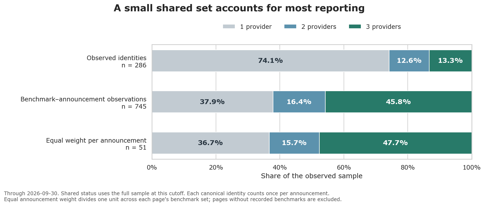
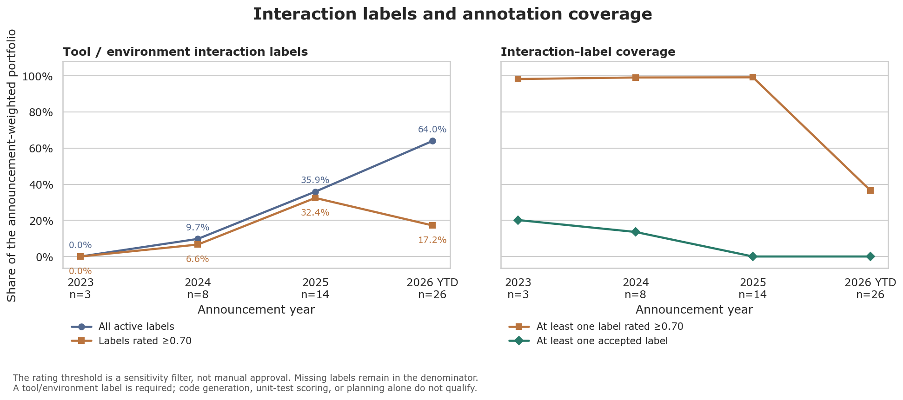

벤치마크는 질문에 답하기, 코드 작성, 도구 사용 등의 과제를 모아 AI 모델을 평가하는 시험이다. 새 모델의 발표에는 여러 벤치마크 결과가 함께 실린다. 회사와 모델 세대가 달라져도 반복해서 등장하는 이름이 있는가 하면, 잠깐 등장하거나 한 회사에서만 보이는 이름도 있다. 이 이름들을 시간에 따라 추적하면 당대의 선도적인 AI 모델, 즉 프런티어 모델을 공개적으로 평가하는 방식이 어떻게 달라지는지 살펴볼 수 있다.

이 프로젝트는 OpenAI, Google, Anthropic의 모델 발표 가운데 선별한 자료에서 벤치마크 이름을 모았다. 어떤 종류의 과제가 등장하는지, 어떤 벤치마크가 공통 기준점이 되는지, 처음 등장한 벤치마크가 이후 얼마나 자주 다시 나타나는지를 살펴본다. 맨 위의 타임라인은 모델 출시의 흐름을 보여 주고, 아래의 분석은 그 안에서 드러나는 양상을 설명한다.

2026년 9월 30일 기준 데이터에서는 여러 회사가 반복해서 언급하는 소수의 벤치마크와 한 번만 등장한 많은 벤치마크가 함께 관측된다. 에이전트형으로 분류된 과제의 비중도 커지지만, 그 변화의 크기는 아직 검토가 끝나지 않은 분류에 크게 좌우된다.

## 어떤 자료를 모았는가

표본에는 2022년 11월부터 2026년 9월까지 발표 55건에 나온 모델 59개가 담겨 있다. 범용 프런티어 모델과 사이버 보안 특화 변형 가운데 일부를 선별했으며, 접근이 제한된 출시도 포함한다. 추가 출시가 있는지는 2026년 10월 4일까지 확인했고, 이 글의 그림과 수치는 9월 30일까지의 발표를 기준으로 한다.

| 회사 | 이름이 붙은 모델 | 발표 | 벤치마크를 언급한 발표 |
| --- | ---: | ---: | ---: |
| Anthropic | 21 | 21 | 19 |
| Google | 17 | 14 | 14 |
| OpenAI | 21 | 20 | 18 |
| 합계 | 59 | 55 | 51 |

모델과 발표는 서로 다른 집계 단위다. 여러 변형 모델이 같은 발표 페이지를 공유할 수 있으므로, 모델을 하나씩 세면 그 페이지의 영향이 커진다. 출시 타임라인에서는 모든 모델을 보여 주기 위해 변형을 각각 표시한다. 공통 벤치마크와 등장 이력을 분석할 때는 같은 회사가 같은 날짜와 출처 페이지에서 발표한 모델들을 하나의 발표로 묶는다.

카탈로그에서는 같은 벤치마크를 가리키는 여러 이름을 하나로 모았다. Terminal-Bench 2.0과 2.1처럼 버전이 명시된 것은 별개의 항목으로 유지했다. 전체 288개 항목 가운데 기준일까지 표본에 등장한 것은 286개다. 예전 항목 중에는 여러 변형을 묶은 것도 있고, 벤치마크 묶음인 스위트와 그 구성 시험이 각각 이름으로 등장하기도 한다. 따라서 이 항목 수를 서로 독립적인 시험의 수로 읽어서는 안 된다.

기록한 이름은 모두 공개 발표 페이지에서 가져왔다. 점수 표, 비교, 각주, 구성 항목 목록, 파트너의 인용문에 나온 이름을 모두 포함한다. 이 기록은 회사들이 공개적으로 무엇을 언급했는지를 보여 준다. 이름이 등장했다는 사실만으로 새 모델을 그 벤치마크로 평가했다거나, 발표에서 중요하게 다뤘다거나, 학습에 사용했다고 단정할 수는 없다.

## 평가 과제의 구성은 어떻게 달라지는가

맨 위의 타임라인은 회사를 세 줄로 나누고, 각 모델을 출시일에 맞춰 배치한 것이다. 원그래프는 그 모델에 기록된 벤치마크의 과제 구성을 보여 준다. 원의 크기는 모두 같으므로 벤치마크 수가 많다고 원이 커지지는 않는다. 벤치마크가 기록되지 않은 모델은 빈 원으로 표시했고, 그림이 복잡해지지 않도록 모델 이름은 일부에만 붙였다.

다섯 가지 색은 더 세밀한 분류를 다음과 같은 과제 유형으로 간추린 것이다.

| 과제 유형 | 뜻 |
| --- | --- |
| Agentic · 에이전트형 과제 | 계획 수립, 도구 사용, 환경 안에서의 행동과 관련된 라벨이 붙은 과제 |
| Multimodal Perception · 멀티모달 이해 | 이미지, 음성, 영상이나 이들과 텍스트를 조합한 입력을 이해하는 과제 |
| Generative Reasoning · 생성·추론 | 문제를 추론하거나 코드 등을 포함한 해답을 만들어 내는 과제 |
| Constraint Satisfaction · 제약 충족 | 지시를 따르거나 규칙, 형식, 안전 조건을 만족해야 하는 과제 |
| Knowledge Retrieval · 지식 검색 | 정보를 떠올리거나 찾아내는 과제. 긴 문맥 처리가 핵심인 과제도 포함 |

하나의 벤치마크에 여러 활동이 섞여 있을 수 있다. 그림에서는 세부 라벨에 일정한 우선순위를 적용해 색을 하나 고른다. 따라서 이 범주들은 서로 겹치는 속성을 시각적으로 요약한 것이며, 바탕이 되는 라벨 상당수는 잠정적이다. 특히 Agentic은 도구를 쓰지 않는 계획 과제도 포함할 수 있다. 도구나 환경과 실제로 상호작용하는 과제는 글의 뒷부분에서 따로 살펴본다.

다음 그림은 각 시점의 직전 180일에 나온 모델들을 묶어 과제 구성을 보여 준다. 이 분류를 적용하면 Agentic은 2024년 9월에 처음 나타나고, 2026년 9월에는 분류된 과제 구성의 약 70%를 차지한다.

계산할 때는 벤치마크가 기록된 모델마다 가중치 1을 주고, 그 모델에 기록된 벤치마크 언급에 고르게 나눈다. 같은 벤치마크가 이후 모델에 다시 등장하면 다시 세며, 함께 발표된 변형 모델도 각각 기여한다. 각 구간에서 분류가 있는 가중치의 합을 100%로 맞추고, 분류된 관측이 없는 구간은 비워 둔다.

색의 변화는 발표 페이지에 등장하는 과제 구성이 달라지고 있음을 보여 준다. 다만 그 비중은 해당 시기에 어느 회사가 모델을 출시했는지, 어떤 벤치마크에 분류가 붙어 있는지에도 영향을 받는다. 초기에는 출시가 드물고, 분류가 없는 벤치마크는 색의 비중을 계산할 때 빠진다. Agentic 과제가 늘어나는 듯한 흐름도 아래의 분류 검토 결과와 함께 읽어야 한다.

## 소수의 공통 벤치마크가 반복해서 등장한다

표본에 나온 벤치마크 이름 대부분은 한 회사의 발표 이력에만 등장한다. 관측된 286개 가운데 두 회사 이상에 나타나는 것은 74개, 곧 25.9%다. 이 중 38개는 세 회사 모두에 등장한다.

이 공통 벤치마크들은 자주 반복된다. 벤치마크를 언급한 발표 51건에서, 벤치마크 하나가 발표 하나에 등장한 경우를 한 쌍으로 세면 총 745쌍이 나온다. 공통 벤치마크가 이 가운데 62.1%를 차지한다.

발표마다 영향력을 같게 맞춰도 이 양상은 유지된다. 각 발표에 가중치 1을 주고 중복을 제거한 벤치마크들에 나누면, 벤치마크가 열 개인 페이지에서는 각각 10분의 1을, 두 개인 페이지에서는 각각 2분의 1을 받는다. 이렇게 계산하면 공통 벤치마크가 발표 하나의 평균적인 벤치마크 구성에서 63.3%를 차지한다. 긴 벤치마크 목록의 영향을 줄이고 함께 발표된 변형 모델들을 묶은 뒤에도 공통 벤치마크가 과반을 차지하는 것이다.

이는 표본 안에 반복해서 언급되는 공통 기준점이 있음을 보여 준다. 회사들이 같은 채점 절차를 사용한다거나 공개된 점수를 곧바로 비교할 수 있다는 뜻은 아니다. 계산할 때도 모든 버전을 하나의 벤치마크 계열로 합치지 않고, 버전을 구분한 카탈로그 항목을 그대로 사용했다.

## 한 번만 등장했다고 수명이 짧은 것은 아니다

반대편에는 발표 한 건에만 등장하는 벤치마크 169개가 있다. 이 중 136개는 2026년에 처음 표본에 들어왔다. 기준일까지 다시 등장할 시간이 충분하지 않았던 경우가 많다.

아래의 등장 이력을 보면 반복되는 언급과 긴 공백을 구분할 수 있다. 각 기호는 해당 벤치마크를 언급한 발표이며, 기호의 모양은 회사를 나타낸다. 회색 선은 처음과 마지막 관측을 이은 것이므로, 그 사이에 언급이 없는 기간도 포함할 수 있다.

초기의 항목에는 수학 문제를 다루는 GSM8K와 코드 생성을 평가하는 HumanEval이 보인다. 이후에는 컴퓨터 사용을 평가하는 OSWorld-Verified와 터미널 환경에서 과제를 수행하는 Terminal-Bench의 여러 버전이 등장한다. 버전마다 행을 따로 두면 발표에서 어느 버전을 언급하는지가 달라지는 과정도 드러난다.

이 이력을 읽을 때는 양 끝의 의미를 구분해야 한다. 첫 관측은 그 벤치마크가 이 표본에 처음 들어온 시점이며, 실제 공개일보다 늦을 수 있다. 마지막 관측은 여기서 확보한 근거가 끝나는 시점일 뿐이다. 그때 벤치마크가 폐기되었거나, 성능이 포화되었거나, 다른 시험으로 대체되었다고 볼 수는 없다. 공백은 회사의 출시 일정과도 함께 살펴야 한다. 새 모델 발표가 없는 기간에는 다시 언급될 기회도 적기 때문이다.

### 다른 회사의 발표에도 얼마나 자주 등장하는가

각 벤치마크가 처음 관측된 때부터 시간을 재고, 30일·90일·180일 안에 두 번째 회사에서도 이름이 나오는지 확인했다. 추적 기간 전체가 2026년 9월 30일까지 끝나는 벤치마크만 각 계산에 포함했다. 한 회사에만 머문 벤치마크도 분모에 들어간다.

| 추적 기간 | 기간 전체를 추적할 수 있는 벤치마크 | 기간 안에 두 번째 회사에서 언급 | 비율 |
| --- | ---: | ---: | ---: |
| 30일 | 209 | 26 | 12.4% |
| 90일 | 160 | 50 | 31.2% |
| 180일 | 113 | 45 | 39.8% |

예를 들어 180일 전체를 추적할 수 있는 벤치마크 113개 가운데 45개가 그 기간 안에 두 번째 회사에서도 등장했다. 기준일에 가까워서 처음 언급된 벤치마크는 아직 이 6개월 비교에 넣을 수 없다.

행마다 추적하는 벤치마크의 집합이 다르므로, 이 비율들을 이어 하나의 채택 곡선으로 볼 수는 없다. 달력상 기간을 모두 확보했다고 해도 그 안에 다른 회사가 모델을 출시했다는 보장은 없다. 이 표는 그런 기회의 차이를 남겨 둔 채, 표본 안에서 언급이 다른 회사로 퍼지는 양상을 보여 준다.

## 에이전트형 과제의 증가를 해석하려면

앞의 넓은 과제 분류에서 한 걸음 더 들어가 보자. 발표된 벤치마크 구성 가운데 실제로 도구나 환경과 상호작용해야 하는 부분은 얼마나 될까? 여기서는 도구 사용, 환경과의 상호작용, 웹 탐색, 터미널·코드베이스 상호작용, 컴퓨터 조작을 나타내는 라벨을 사용한다. 정적인 코드 생성, 단위 테스트 채점, 계획 수립만으로는 이 정의에 해당하지 않는다.

공통 벤치마크 분석과 마찬가지로 발표마다 같은 가중치를 준 뒤, 어떤 라벨을 사용할지에 따라 결과를 비교했다. 현재 유효한 라벨 전체, 신뢰도 0.70 이상인 라벨, 검토를 거쳐 승인된 라벨의 세 가지 경우다. 신뢰도는 결과의 민감도를 확인하기 위한 필터이며, 정답일 확률이나 검토 완료를 뜻하지 않는다.

2026년에 벤치마크를 언급한 발표 26건에서는 선택에 따라 결과가 크게 달라진다.

| 사용한 라벨 | 도구·환경 상호작용 라벨이 붙은 가중치 | 상호작용 유형을 분류할 수 있는 가중치 |
| --- | ---: | ---: |
| 잠정 라벨을 포함한 현재 유효 라벨 전체 | 64.0% | 100.0% |
| 신뢰도 0.70 이상인 라벨 | 17.2% | 36.6% |
| 검토를 거쳐 승인된 라벨만 사용 | 검토된 근거로 추정할 수 없음 | 0.0% |

마지막 열은 분류가 얼마나 갖춰져 있는지 나타내는 커버리지다. 필터를 적용한 뒤에도 상호작용 유형을 설명하는 라벨이 하나라도 남아 있으면 분류된 것으로 센다. 정적인 과제임을 나타내는 라벨도 여기에 포함된다. 두 열 모두 원래 가중치 전체를 분모로 사용한다. 라벨이 사라진 벤치마크는 미분류 상태로 가중치를 유지하며, 남은 라벨의 비중을 늘려 그 공백을 채우지는 않는다.

이 공백 때문에 추정치를 해석할 때 주의가 필요하다. 2025년에는 신뢰도 기준을 통과한 라벨이 가중치의 99.2%를 덮고, 상호작용 비중은 32.4%다. 2026년에는 커버리지가 36.6%로 낮아지면서 측정된 비중도 17.2%로 내려간다. 이 비교만으로 상호작용 과제가 줄었다고 단정할 수는 없다. 승인된 라벨의 커버리지가 0이라는 것 역시 검토를 거친 추정 근거가 없다는 뜻이다.

집계 단위를 발표에서 개별 모델로 바꾸면 2026년의 전체 라벨 기준 추정치는 64.0%에서 64.4%로 조금 달라진다. 어떤 라벨을 남기느냐의 영향이 훨씬 크다. 전체 분류 표의 라벨 4,052개 가운데 승인된 것은 36개뿐이다. 3,956개는 아직 검토가 필요하고, 60개는 충분한 검토 없이 예전 분류 과정에서 만들어졌다. 벤치마크 이름이 무엇을 가리키는지 확인하는 일과 그 벤치마크가 어떤 과제를 측정하는지 검토하는 일은 별개의 작업이다.

## 이 이력에서 알 수 있는 것

가장 뚜렷한 양상은 여러 회사가 반복해서 언급하는 벤치마크와 한 번만 등장한 긴 목록이 함께 존재한다는 점이다. 발표마다 같은 가중치를 주어도 소수의 벤치마크가 기록된 등장 횟수의 대부분을 차지한다. 과제 유형 그림은 발표된 평가 구성이 어떻게 달라지는지 보여 주지만, 에이전트형 과제가 얼마나 늘었는지는 아직 끝나지 않은 분류 작업에 민감하다.

표본은 선별된 것이고 시기별 수집 범위도 다르며, 발표 페이지는 공개 뒤 수정되었을 수 있다. 따라서 이 자료는 공개된 벤치마크 언급의 이력으로 활용할 수 있지만, 모델 평가 전체를 빠짐없이 보여 주지는 않는다. 다음 단계는 결과에 영향이 큰 라벨을 검토하고, 벤치마크의 버전과 계열 관계를 정리하며, 각 언급이 직접 보고한 결과인지 비교·구성 항목·인용인지 구분하는 것이다. 당시 발표 페이지의 보관본과 벤치마크 공개일을 확보하면 시간에 따른 변화도 더 정확히 살펴볼 수 있다.

## 데이터와 참고 자료

개별 관측을 확인하거나 그림을 재현할 수 있도록 원자료와 분석 코드를 공개했다.

- [모델 목록과 출처 페이지](https://github.com/isingmodel/evolution_of_benchmarks_in_frontier_models/blob/main/data/models.csv), [벤치마크 카탈로그](https://github.com/isingmodel/evolution_of_benchmarks_in_frontier_models/blob/main/data/benchmarks.csv).
- 발표별 가중치, 추적 기간, 분류 커버리지를 설명하는 [계산 방법](https://github.com/isingmodel/evolution_of_benchmarks_in_frontier_models/blob/main/analysis/project_overview/README.md).
- [타임라인 작성 방법](https://github.com/isingmodel/evolution_of_benchmarks_in_frontier_models/blob/main/analysis/benchmark_evolution/README.md), [이동 구간 계산 방법](https://github.com/isingmodel/evolution_of_benchmarks_in_frontier_models/blob/main/analysis/benchmark_taxonomy_trends/README.md).
- 기준일까지 등장하지 않은 두 항목을 포함해 카탈로그 288개 전체를 다룬 [등장 이력 보고서](https://github.com/isingmodel/evolution_of_benchmarks_in_frontier_models/blob/main/analysis/benchmark_lifecycle/report.md).
- [분류 근거](https://github.com/isingmodel/evolution_of_benchmarks_in_frontier_models/blob/main/analysis/project_overview/interaction_classification.csv), [데이터 점검 문서](https://github.com/isingmodel/evolution_of_benchmarks_in_frontier_models/blob/main/docs/readme_data_audit_2026_10_04.md).

분석을 재현하고 데이터를 확장하는 방법은 [프로젝트 저장소](https://github.com/isingmodel/evolution_of_benchmarks_in_frontier_models#reproduce-and-extend)에 정리되어 있다.
